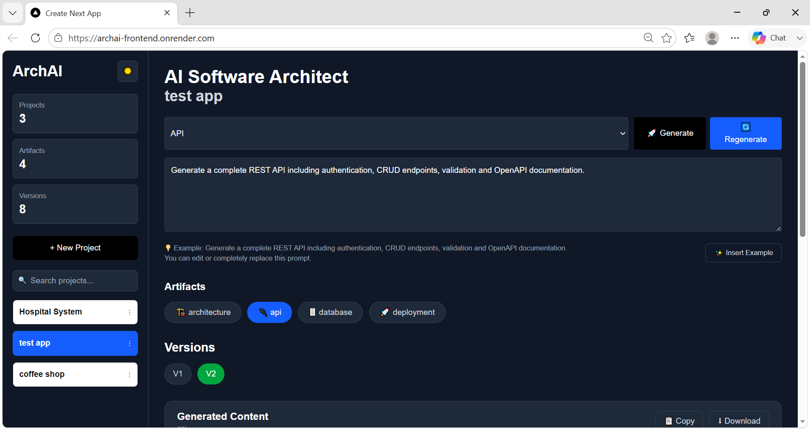
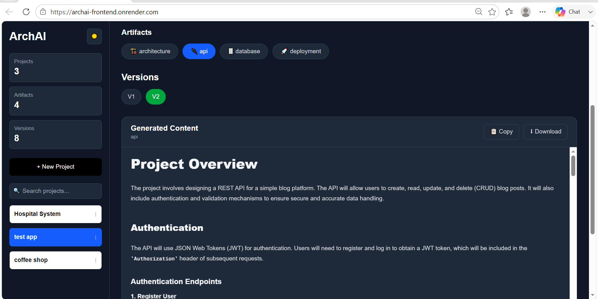
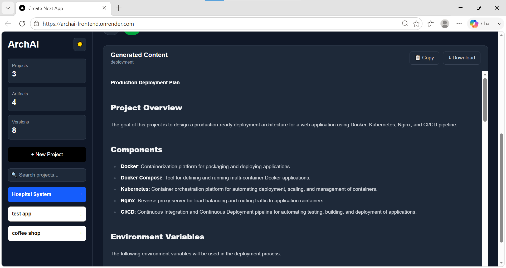

#  ArchAI – AI Software Architecture Generator

> **ArchAI** is a Full-Stack AI platform that transforms software ideas into complete software architecture designs using Large Language Models (LLMs). It helps developers generate architecture documents, APIs, database schemas, and versioned technical artifacts through a modern web interface.

## Live Demo

###  Frontend

https://archai-frontend.onrender.com

###  Backend API

https://archai-backend-ccgm.onrender.com

###  Swagger Documentation

https://archai-backend-ccgm.onrender.com/docs

# ✨ Features

* 🤖 AI-powered architecture generation
* 🏗️ Software architecture recommendations
* 🗄️ Database schema generation
* 🔌 REST API design generation
* 📁 Folder structure suggestions
* 📜 Version history for generated artifacts
* 📦 PostgreSQL data persistence
* ⚡ FastAPI backend
* 🎨 Modern Next.js frontend
* 🐳 Dockerized deployment
* ☁️ Cloud deployment using Render
* 🗃️ PostgreSQL hosted on Neon

# 🏛️ System Architecture

                     +----------------------+
                     |     Next.js 16       |
                     |      Frontend        |
                     +----------+-----------+
                                |
                                | REST API
                                |
                     +----------v-----------+
                     |       FastAPI        |
                     |       Backend        |
                     +----------+-----------+
                                |
              +-----------------+-----------------+
              |                                   |
              |                                   |
      +-------v-------+                  +--------v--------+
      | AI Providers  |                  | PostgreSQL DB   |
      | Gemini / Groq |                  |      Neon       |
      +---------------+                  +-----------------+

# 🛠️ Tech Stack

## Frontend

* Next.js 16
* React 19
* TypeScript
* Axios
* Tailwind CSS

## Backend

* FastAPI
* SQLAlchemy
* Alembic
* Pydantic
* Python

## AI

* Google Gemini
* Groq

## Database

* PostgreSQL
* Neon

## Deployment

* Docker
* Render

# 📂 Project Structure

ArchAI
│
├── ai-service
│   ├── app
│   │   ├── api
│   │   ├── core
│   │   ├── db
│   │   ├── models
│   │   ├── orchestrator
│   │   ├── providers
│   │   ├── repositories
│   │   ├── schemas
│   │   └── services
│   │
│   ├── alembic
│   ├── Dockerfile
│   └── requirements.txt
│
├── web-app
│   ├── app
│   ├── components
│   ├── lib
│   ├── public
│   └── Dockerfile
│
└── docker-compose.yml

# 📡 REST API

## Health

| Method | Endpoint  | Description          |
| ------ | --------- | -------------------- |
| GET    | `/health` | Backend health check |

## AI Generation

| Method | Endpoint           | Description              |
| ------ | ------------------ | ------------------------ |
| POST   | `/api/v1/generate` | Generate AI architecture |

## Projects

| Method | Endpoint                                  | Description                |
| ------ | ----------------------------------------- | -------------------------- |
| GET    | `/api/v1/projects`                        | Retrieve all projects      |
| POST   | `/api/v1/projects`                        | Create a new project       |
| GET    | `/api/v1/projects/{project_id}/artifacts` | Retrieve project artifacts |
| PUT    | `/api/v1/projects/{project_id}`           | Rename project             |
| DELETE | `/api/v1/projects/{project_id}`           | Delete project             |

## Artifacts

| Method | Endpoint                                             | Description                 |
| ------ | ---------------------------------------------------- | --------------------------- |
| GET    | `/api/v1/artifacts/{artifact_id}/versions`           | Retrieve artifact versions  |
| GET    | `/api/v1/artifacts/{artifact_id}/versions/{version}` | Retrieve a specific version |

# ⚙️ Local Setup

## Clone Repository

git clone https://github.com/Zainab-Kawsan/ArchAI.git

cd ArchAI

## Backend

cd ai-service

python -m venv venv

# Windows
venv\Scripts\activate

pip install -r requirements.txt

alembic upgrade head

uvicorn app.main:app --reload

## Frontend

cd web-app

npm install

npm run dev

# 🔑 Environment Variables

## Backend (.env)

DATABASE_URL=your_database_url

GEMINI_API_KEY=your_gemini_api_key

GROQ_API_KEY=your_groq_api_key

DEFAULT_PROVIDER=gemini

FALLBACK_PROVIDER=groq

## Frontend (.env.local)

NEXT_PUBLIC_API_URL=http://127.0.0.1:8000/api/v1

# 🐳 Docker

## Build Backend

docker build -t archai-backend ./ai-service

## Build Frontend

docker build -t archai-frontend ./web-app

## Run Everything

docker compose up --build

# ☁️ Deployment

### Frontend

* Render
* Docker

### Backend

* FastAPI
* Docker
* Render

### Database

* PostgreSQL (Neon)

## 📸 Screenshots

### Dashboard

### Versions

### Generated Content

# 🚀 Future Improvements

* User Authentication
* JWT Authorization
* Export to PDF
* Mermaid Architecture Diagrams
* Cost Estimation
* Multiple AI Models
* Team Collaboration
* Project Sharing
* CI/CD Pipeline
* Unit & Integration Testing

# 👩‍💻 Author

Zainab Kawsan

GitHub

https://github.com/Zainab-Kawsan

# 📜 License

This project is licensed under the MIT License.
